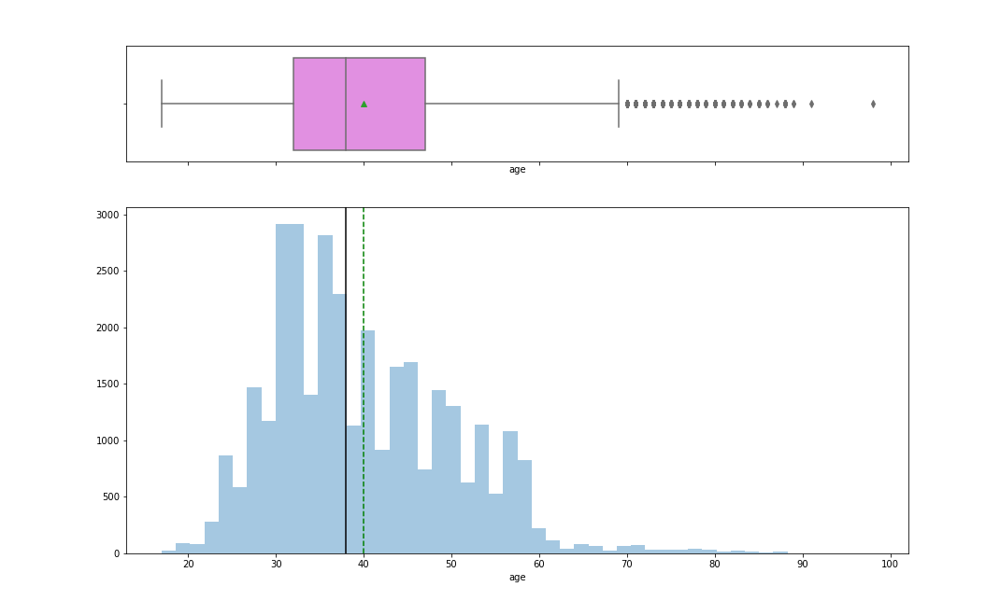

# Customer-Marketing Campaign-Classification-Model

## Problem Definition:
The purpose of this classification model is to predict if the client will subscribe (yes/no) a term deposit (variable y).

## Purpose:
- Can be used in any financial service sector to support marketing campaign.

## Datasets:
**train.csv:** Each row represents an observation for each individual campaign and the customer response. The dataset contains 15 columns and 32950 observations.

## Feature Description:

**age:** numeric	age of a person

**job:** 	type of job ('admin.','blue-collar','entrepreneur','housemaid','management','retired','self-employed','services','student','technician','unemployed','unknown')

**marital:**	marital status ('divorced','married','single','unknown'; note: 'divorced' means divorced or widowed)

**education:**	('basic.4y','basic.6y','basic.9y','high.school','illiterate','professional.course','university.degree','unknown')

**default:**	has credit in default? ('no','yes','unknown')

**housing:** 	has housing loan? ('no','yes','unknown')

**loan:**		has personal loan? ('no','yes','unknown')

**contact:**	contact communication type ('cellular','telephone')

**month:**	last contact month of year ('jan', 'feb', 'mar', …, 'nov', 'dec')

**dayofweek:**	last contact day of the week ('mon','tue','wed','thu','fri')

**duration:**	last contact duration, in seconds . Important note: this attribute highly affects the output target (e.g., if duration=0 then y='no')

**campaign:**	number of contacts performed during this campaign and for this client (includes last contact)

**pdays:**	number of days that passed by after the client was last contacted from a previous campaign (999 means client was not previously contacted)

**previous:**	number of contacts performed before this campaign and for this client

**poutcome:**	outcome of the previous marketing campaign ('failure','nonexistent','success')

**Target variable:** y	binary	has the client subscribed a term deposit? ('yes','no')

## Data Preprocessing:

**Cleaning and Explanatory Data Analysis**

Checked for null values.

Checked for duplicate values, Deleted the 8 duplicated rows.

Checked for the distribution of target variable, where the target variable is highly imbalance. 

  

The below table shows that the target variable contains the data with the ratio of 89% "NO" to 11% "Yes", which is highly imbalanced dataset. 

|  | Count | 	% |
| ---- | ----- | ----- |
| no |	29230 |	0.887317 |
| yes	| 3712 |	0.112683 |

Performed subsetting of data to extract the data that has the target variable "yes" to conduct EDA.

Performed explanatory data analysis to learn more about the relation between each feature and the target variable.

____________________________________________________
#### All categorical features versus target variable
_____________________________________________________

Below are the charts to describe the independent features in reference to the target variable "yes" who all accepted the subsription.

Above charts shows that *married* customer with *university or high school* degree are more likely to agree for long term deposit. Similarly,
campaigns conducted during *summer* months and *middle of weekdays* are comparatively effective.

________________________________
#### Age Distribution
__________________________

* The data is right skewed to see extreme outliers 
* Undeserved age category to be less than 20 years or age older than 60.

______________________
#### Duration Distribution
_________________________

* The duration seems to the right skewed with ouliers.
* The mean duration for a call is 180 mins.

_________________
#### PairPlot
_______________

Pairplot to describe the relation between the variables

From pairplot, it shows that the duration and the campaign mostly focused on younger people and skewed down as the age goes up, as per the 
data description values (pdays=999) means was not contacted before - Ignoring that, whomever was contacted was done with in the last 30 days. 
In most cases the number of times contacted before a campaign was < 6 times.

## Feature Engineering:

Performed one-hot encoding for nominal categorical variable like jobType, major and industry and performed label encoding for degree, used the educational level for labeling eventhough it is not a typical ordinal variable.

### Checked for correlation:

Most of the features are positively correlated with the target variable salary and they is no evidence of muticollinearlity of correlation > 0.9, whereas milesFromMetropolis is negatively correlated with Salary.

 
